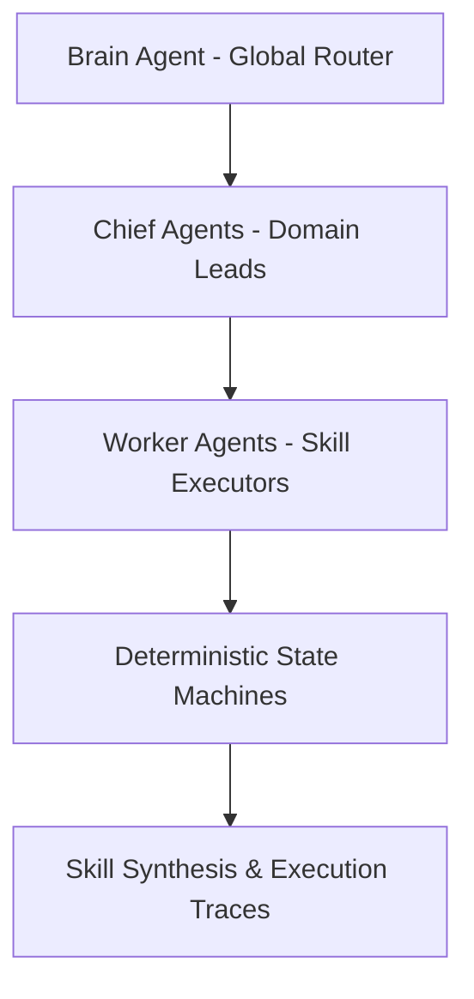

# Atlantida OS — Autonomous Cloud AI Operating System

[](https://github.com/emirperla96-lab/atlantida-os/actions/workflows/ci.yml)
[](https://hub.docker.com/r/emirperla96/atlantida-os)
[](https://opensource.org/licenses/MIT)


Atlantida OS is a production-grade, 24/7 autonomous cloud AI operating platform. It is engineered to orchestrate multi-agent workflows, featuring deterministic state machines and automated skill synthesis directly from execution traces.

## System Architecture

The system utilizes a hierarchical 10-agent orchestration collective executing 76 modular skills across 9 autonomous domains.



## Core Features

* **Hierarchical 10-Agent Collective:** (Brain → Chiefs → Workers) topology routing complex workflows across 9 business domains.
* **Automated Skill Synthesis:** Real-time A2A (Agent-to-Agent) message passing with deterministic state machines that convert execution traces into reusable, parameterized tools.
* **3D Neural Command Center:** Real-time interactive UI built with Three.js and deployed as a Progressive Web App (PWA) for visualizing multi-agent Directed Acyclic Graphs (DAGs).
* **Zero-Overhead Infrastructure:** Autonomous background daemon loops containerized via Docker and deployed on Fly.io, designed for continuous uptime with minimal cloud footprint.

## Quickstart

```bash
# Clone the repository
git clone https://github.com/emirperla96-lab/atlantida-os.git
cd atlantida-os

# Build and run with Docker
docker build -t atlantida-os .
docker run -p 8000:8000 atlantida-os
```
