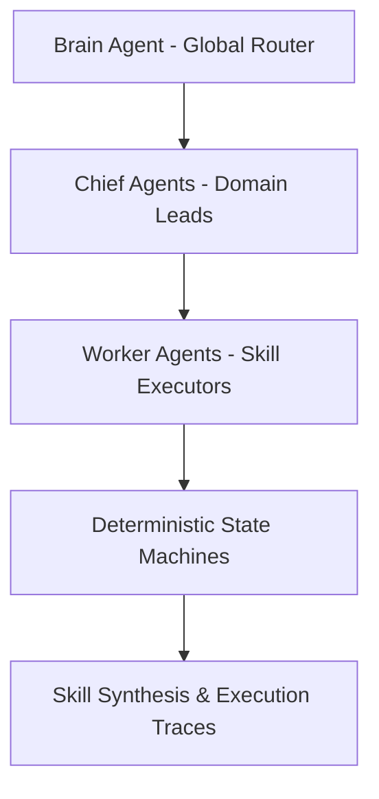

# FoundationCentar — AtlanTida OS Autonomous Cloud AI Operating System

[](https://github.com/we-do-care-global/FoundationCentar/actions/workflows/ci.yml)
[](https://ghcr.io/we-do-care-global/FoundationCentar)
[](https://opensource.org/licenses/MIT)


FoundationCentar is a production-grade, 24/7 autonomous cloud AI operating platform. It is engineered to orchestrate multi-agent workflows, featuring deterministic state machines and automated skill synthesis directly from execution traces.

## System Architecture

The system utilizes a hierarchical 10-agent orchestration collective executing 76 modular skills across 9 autonomous domains.



## Core Features

* **Hierarchical 10-Agent Collective:** (Brain → Chiefs → Workers) topology routing complex workflows across 9 business domains.
* **Automated Skill Synthesis:** Real-time A2A (Agent-to-Agent) message passing with deterministic state machines that convert execution traces into reusable, parameterized tools.
* **3D Neural Command Center:** Real-time interactive UI built with Three.js and deployed as a Progressive Web App (PWA) for visualizing multi-agent Directed Acyclic Graphs (DAGs).
* **Zero-Overhead Infrastructure:** Autonomous background daemon loops containerized via Docker and deployed on Fly.io, designed for continuous uptime with minimal cloud footprint.

## Quickstart

```bash
# Clone the repository
git clone https://github.com/we-do-care-global/FoundationCentar.git
cd FoundationCentar

# Build and run with Docker
docker build -t foundationcentar .
docker run -p 8000:8000 foundationcentar
```

## API Endpoints

| Endpoint | Method | Description |
|---|---|---|
| `/` | GET | Health/running message |
| `/health` | GET | Status `ok`, version `1.0.0` |
| `/api/v1/agents` | GET | Lists Brain + all Chiefs + Workers |
| `/api/v1/skills` | GET | Lists implemented skills |
| `/api/v1/brain/route` | POST | Route request through Brain |
| `/api/v1/execute-skill` | POST | Execute a skill |
| `/api/v1/create-agent` | POST | Register new agent |
| `/api/v1/synthesize-skill` | POST | Synthesize skill from traces (placeholder) |
| `/api/v1/traces` | GET | Execution traces (placeholder) |

## Modes

```bash
# Start API server
python src/main.py --mode server

# Run CLI demo (default)
python src/main.py

# Run cyclical daemon (300s interval)
python src/main.py --daemon
```

## Implemented Skills

1. **smart_meter_diagnostic** — Diagnoses smart meter consumption anomalies (>350 kWh threshold), detects tariff wasting, recommends time-of-use switches (Economy 7, Intelligent Octopus)
2. **half_hourly_reconciliation** — Reconciles half-hourly consumption vs expected, calculates variance, flags if >5%

## Deployment

- **Docker**: `docker build -t foundationcentar . && docker run -p 8000:8000 foundationcentar`
- **GHCR**: `ghcr.io/we-do-care-global/FoundationCentar` (auto-built on push to main)
- **Fly.io**: Requires Cloudflare API token (see Fly.io docs)

## License

MIT — see [LICENSE](LICENSE) for details.
